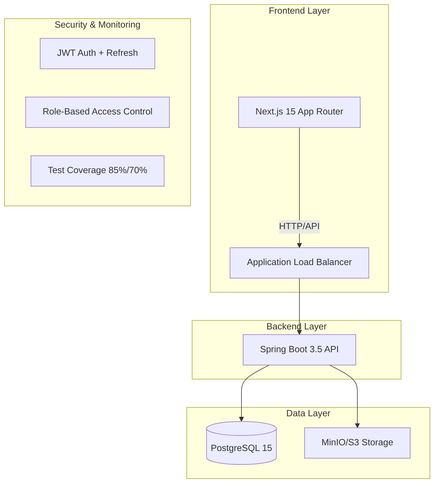
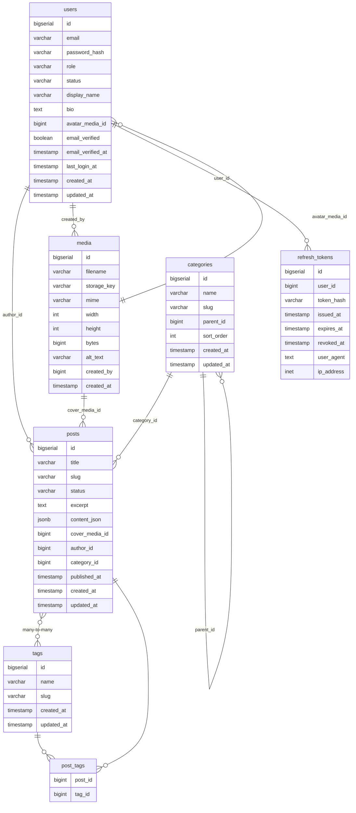

[]()
[]()
[]()
[]()
[]()

# PostFlow - エンタープライズ CMS プラットフォーム

**Spring Boot 3.5 + Next.js 15 によるモダンフルスタック構成**

## PostFlow の特徴

-   **モダンフルスタック構成**: Spring Boot 3.5 + Next.js 15 + PostgreSQL
-   **AWS 3 層構成対応**: ALB / ECS Fargate / RDS / S3 / Route53 / EventBridge
-   **品質保証**: JaCoCo 85%/70% カバレッジ、246 テストケース
-   **セキュリティ**: JWT 認証 + RBAC + OWASP ベース設計
-   **IaC 対応**: Terraform による再現可能インフラ（構築中）

## プロジェクト概要

PostFlow は、AWS 3 層構成での本番運用を想定した CMS/ブログプラットフォームです。

## デモ環境

### トップページ

-   [https://demo.postflow.work/](https://demo.postflow.work/)
-   **ベーシック認証**（デモ環境保護用）: ID `demo` / PASS `postflow2025`

### ログインページ（アプリ内認証）

-   [https://demo.postflow.work/login](https://demo.postflow.work/login)
-   **ログイン情報（アプリ内ユーザー）**: ID `admin@example.com` / PASS `password123`

### 注意事項

-   投稿データおよびメディアは、1 時間ごとに初期化されます。

## 品質指標

-   **テストカバレッジ**: 85% (命令) / 70% (ブランチ)
-   **テストケース数**: 246 件 (実行時間: 約 60 秒)
-   **コミット運用**: 1 コミット 1 論理変更の徹底
-   **CI/CD**: GitHub Actions による自動ビルド・テスト

[](https://github.com/koichiro-38lab/postflow/actions/workflows/ci-backend.yml)
[](https://github.com/koichiro-38lab/postflow/actions/workflows/ci-frontend.yml)
[](https://github.com/koichiro-38lab/postflow/actions/workflows/ci-full.yml)

## アーキテクチャ

### システム構成図



### 技術スタック

#### バックエンド (Spring Boot 3.5)

-   **認証**: JWT + リフレッシュトークンローテーション
-   **認可**: RBAC (ADMIN/EDITOR/AUTHOR)
-   **API**: RESTful 設計 + OpenAPI 準拠
-   **永続化**: PostgreSQL + Flyway マイグレーション
-   **テスト**: JUnit 5 + AssertJ + MockMvc
-   **メディア**: S3 互換 MinIO + presign URL

#### フロントエンド (Next.js 15)

-   **UI**: shadcn/ui + Tailwind CSS
-   **エディタ**: TipTap v3 リッチテキストエディタ
-   **状態管理**: Zustand + Auth Store
-   **ファイル処理**: React Dropzone

## データベース設計

### ERD (Entity Relationship Diagram)



### 多層防御アーキテクチャ

1. **JWT 認証**: アクセス(15 分) + リフレッシュ(7 日)トークン
2. **RBAC**: メソッドレベル認可制御
3. **入力検証**: Bean Validation + カスタムバリデータ
4. **例外処理**: `GlobalExceptionHandler`で統一エラーハンドリング
5. **パスワード**: BCrypt + ソルトによるハッシュ化

### RBAC（Role-Based Access Control）

PostFlow では、Spring Security と Policy 層によって厳格なロールベースアクセス制御を実装しています。

| リソース     |           ADMIN           |    EDITOR    |              AUTHOR              | 主な制御ロジック            |
| ------------ | :-----------------------: | :----------: | :------------------------------: | --------------------------- |
| Posts        |       ○ 全件操作可        | ○ 全件操作可 | △ 自分の投稿のみ編集可／公開不可 | `PostPolicy`, `PostService` |
| Media        |       ○ 全件操作可        | ○ 全件操作可 |     △ 自分のアップロードのみ     | `MediaPolicy`               |
| Categories   |             ○             |      ○       |                ✕                 | `CategoryPolicy`            |
| Tags         |             ○             |      ○       |                ✕                 | `TagPolicy`                 |
| Users        | ○（管理者自信は削除不可） |      ✕       |                ✕                 | `UserPolicy`                |
| Self Profile |        ○ 自分のみ         |  ○ 自分のみ  |            ○ 自分のみ            | `UserPolicy`                |

## 開発環境

### Docker Compose 構成

```yaml
services:
  frontend:3000  # Next.js development server
  backend:8080   # Spring Boot + devtools
  postgresql:5432 # PostgreSQL 15
```

### クイックスタート (ローカル開発)

```bash
# 1. 依存ファイルを準備
cp .env.example .env

# 2. Docker Compose 起動
docker compose up --build

```

-   デフォルトで `admin@example.com / password`, `editor@example.com / password`, `author@example.com / password` の 3 役職ユーザーが投入済み
-   停止: `docker compose down`
-   ログ確認: `docker compose logs -f backend` など各サービス毎に可能

### 主要環境変数

| 区分     | キー                                                                                | 用途                                    |
| -------- | ----------------------------------------------------------------------------------- | --------------------------------------- |
| アプリ   | `PORT_FRONTEND`, `PORT_BACKEND`                                                     | ローカルポート設定                      |
| DB       | `POSTGRES_DB`, `POSTGRES_USER`, `POSTGRES_PASSWORD`                                 | PostgreSQL 接続                         |
| MinIO    | `MINIO_ROOT_USER`, `MINIO_ROOT_PASSWORD`, `S3_BUCKET`                               | メディア保存先                          |
| 認証     | `JWT_SECRET`, `JWT_ACCESS_TTL`, `JWT_REFRESH_TTL`                                   | JWT 署名・TTL                           |
| デプロイ | `VPS_HOST`, `VPS_USER`, `VPS_SSH_KEY`, `VPS_PROJECT_DIR`, `VPS_SSH_PORT`, `VPS_ENV` | GitHub Actions → VPS デプロイ用 Secrets |

※ `.env.example` に開発用のサンプル値を記載。公開リポジトリ化後も秘密情報は `.env` と GitHub Secrets のみで管理してください。

## CI/CD & Deploy

1. **Full CI Pipeline (`ci-full.yml`)**
    - Backend/Frontend のテスト・Lint・TypeCheck を並列実行
    - docker-compose 設定検証、Codecov アップロード、サマリレポート
2. **Deploy to VPS (`deploy-vps.yml`)**
    - トリガー: Full CI 成功時の `workflow_run` or `workflow_dispatch`
    - 処理: `git fetch --prune` → `git pull --ff-only` → `docker compose -f docker-compose.yml -f docker-compose.demo.yml up -d --remove-orphans`
    - 安全策: 未コミット検知、Secrets 必須チェック、`.git/deploy.log` への履歴追記、Step Summary で実行状況を可視化

### デプロイ運用メモ

-   将来的にコンテナイメージ配信へ移行する際は GitHub Actions で ECR へ push し、compose をイメージ参照に切り替える計画です

### セットアップ手順

```bash
# リポジトリクローン
git clone https://github.com/koichiro-38lab/postflow.git
cd postflow

# 環境変数設定
cp .env.example .env

# Docker環境起動
docker compose up --build

# アクセス確認
# フロントエンド: http://localhost:3000
# バックエンドAPI: http://localhost:8080
# MinIO管理画面: http://localhost:9001
```

### シードデータ

#### 簡易シード（初回起動時・自動）

初回 `docker compose up` 時に自動投入される最低限のデータ:

-   **ユーザー 3 名**: admin@example.com, editor@example.com, author@example.com (パスワード: `password123`)
-   **カテゴリ 2 件**: テクノロジー, ビジネス
-   **タグ 5 件**: Spring Boot, Next.js, AWS, Docker, PostgreSQL
-   **サンプル投稿 1 件**: ウェルカム投稿

#### フルシード（手動実行・開発用）

投稿 100 件・カテゴリ 10 件・タグ 30 件・メディア多数を投入するフルデモデータ:

```bash
# ワンライナーで実行（推奨）
TOKEN=$(curl -s -X POST http://localhost:8100/api/auth/login -H "Content-Type: application/json" -d '{"email":"admin@example.com","password":"password123"}' | jq -r '.accessToken') && curl -X POST http://localhost:8100/api/admin/demo/reset-full -H "Authorization: Bearer $TOKEN"
```

**注意**: フルシード実行には ADMIN 権限が必要です。

## テスト戦略

### 246 テストケース構成

-   **Unit Tests**: Service/Repository 層の単体テスト
-   **Integration Tests**: MockMvc によるコントローラーテスト
-   **Security Tests**: 認証・認可・Policy テスト
-   **Data Tests**: `TestDataConfig` + `TestClockConfig`

### カバレッジレポート

```bash
# テスト実行 + カバレッジレポート生成
cd backend
./mvnw clean test

# レポート確認
open target/site/jacoco/index.html
```

## 本番デプロイ (AWS 3 層構成)

### インフラ構成 (予定)

-   **Route53 + ACM**: 独自ドメイン + SSL 証明書
-   **ALB**: アプリケーションロードバランサ
-   **ECS Fargate**: コンテナオーケストレーション
-   **RDS PostgreSQL**: マネージドデータベース
-   **S3**: メディアファイルストレージ
-   **EventBridge**: デイタイム稼働スケジューリング

### CI/CD パイプライン

```yaml
# GitHub Actions
Backend CI: Test → Coverage Check (85%/70%) → Build JAR
Frontend CI: Lint → Type Check → Build Next.js
Full CI: Integration Check → Summary Report

# 予定
Build → ECR Push → ECS Deploy (本番デプロイ自動化)
```

**カバレッジ基準の自動チェック**:

-   Instructions ≥ 85%
-   Branches ≥ 70%
-   基準未達時は CI が失敗し、マージをブロック

## ビジネス価値・アピールポイント

**エンタープライズパターン**: DDD + Clean Architecture  
**最新技術**: Spring Boot 3.5 + Next.js 15  
**品質担保**: テストカバレッジ 85%達成  
**セキュリティ**: OWASP 準拠設計  
**スケーラビリティ**: ECS Fargate + RDS 対応  
**保守性**: コミット粒度の徹底管理

### 開発プロセス

-   **戦略的テスト設計**: 統合テスト中心から始め、Security/S3 Media 層のユニットテスト追加により、カバレッジを 69%→85%へ改善
-   **継続的品質改善** (JaCoCo レポート分析による PDCA サイクル)

## ライセンス

MIT License

## 連絡先

プロジェクト管理者: [@koichiro-38lab](https://github.com/koichiro-38lab)

---

**Star をいただけると開発の励みになります！**
